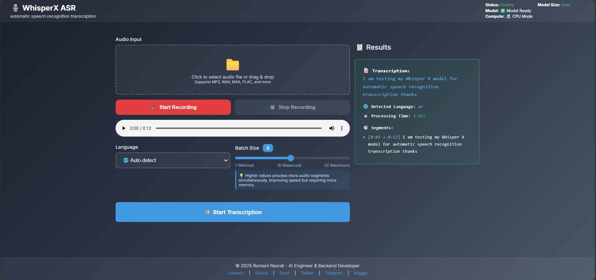

<div align="center">
  
  <br />
</div>

<div align="center">
    
    
    
    
    
    
    
    
</div>
</div>

# WhisperX ASR with FastAPI


**WhisperX ASR** is a production-ready automatic speech recognition (ASR) app powered by [WhisperX](https://github.com/m-bain/whisperx) and FastAPI. It provides a web UI and REST API for transcribing audio files with word-level timestamps, multi-language support, and GPU acceleration.

For advanced configuration, model options, and setup instructions, see the original WhisperX repository: [https://github.com/m-bain/whisperX](https://github.com/m-bain/whisperX)

---

## 🚀 Features

- FastAPI backend for robust, scalable API serving
- WhisperX model for accurate speech-to-text transcription
- Web UI for uploading audio, recording, and viewing results
- Supports multiple audio formats: WAV, MP3, M4A, FLAC, OGG, WEBM
- Language selection (auto-detect or manual)
- Batch size control for performance tuning
- Word-level timestamps and segments in results
- GPU acceleration (if available)
- Health check endpoint for monitoring model status

---

## 🛠️ Technologies

- FastAPI
- WhisperX
- Uvicorn
- Python 3.11.5
- HTML/CSS/JS for the frontend

---

## 📦 Installation & Usage

### Requirements
- Python 3.11.5+
- uvicorn 
- uv package manager
- CUDA-enabled GPU for acceleration (you can run on CPU but slower)

### Setup

```bash
# Clone the repository
git clone https://github.com/romanyn36/whisperx-automatic-speech-recognition.git
cd whisperx-automatic-speech-recognition

# setup virtual environment
uv sync 
.\.venv\Scripts\activate # Windows
source .venv/bin/activate  # Linux/Mac

# copy the example env file and modify as needed
cp .env.example .env

# Start the server
uv run python main.py --reload

# access the web UI at http://localhost:8000/static/
```

---

## 📝 API Endpoints

### Health Check
`GET /health`
- Returns model status, GPU info, and readiness.

### Supported Languages
`GET /languages`
- Lists available transcription languages.

### Transcribe Audio
`POST /transcribe`
- Parameters:
  - `file`: Audio file (WAV, MP3, M4A, FLAC, OGG, WEBM)
  - `language`: Language code (e.g., `en`, `auto`)
  - `batch_size`: Integer (1–32)
- Returns:
  - `transcription`: Full text
  - `language`: Detected language
  - `processing_time`: Seconds
  - `segments`: List of segments with timestamps
  - `word_segments`: List of word-level timestamps

---

## 🌐 Web UI

Open [http://localhost:8000/](http://localhost:8000/) in your browser. Features:
- Upload or record audio
- Select language and batch size
- View transcription, segments, and word-level timestamps

---

## ⚙️ Configuration

You can adjust model size, alignment, and file size limits via environment variables in `.env`:
- `MODEL_SIZE` (e.g., `large-v2`, `medium`, `tiny`)
  in my gtx 1650 GPU the large-v3-turbo works excellent
- `ENABLE_ALIGNMENT` (`true`/`false`)
- `MAX_FILE_SIZE_MB` (default: 100)
- `API_KEY` (optional, disabled by default)

---
# What's Next
as this project is still ongoing and this is just the first development phase there are many features to come
- currently working deploy on gpu (runpod)
- add production ready docker support
- built github actions for auto deployment
- testing and improvements among others whisperx features

## 📄 License

This project is licensed under the MIT License. See [LICENSE](LICENSE).

---


## 👤 Author & Contact

<div align="center">
  <a href="mailto:romani.nasrat@gmail.com" target="_blank">
    
  </a>
  <a href="https://www.linkedin.com/in/romaninasrat/" target="_blank">
    
  </a>
  <a href="https://x.com/RomaniNasrat" target="_blank">
    
  </a>
  <a href="https://t.me/romanyn36" target="_blank">
    
  </a>
  <a href="https://github.com/romanyn36" target="_blank">
    
  </a>
  <a href="https://kaggle.com/romanyn36" target="_blank">
    
  </a>
</div>

<div align="center">
  <b>Made by Romani Nasrat – AI Engineer & Backend Developer</b><br>
  <a href="mailto:romani.nasrat@gmail.com">romani.nasrat@gmail.com</a> | <a href="https://romani-nasrat.com">Portfolio</a>
</div>


